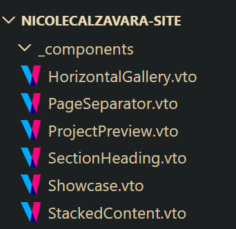

# Summary of Work up till NYE 2025

- Deployed site: https://nicolecalzavara.netlify.app/
- Repo (with README): https://github.com/lexfeathers/nicolecalzavara-site

---

Hey Naya, here's the summary of work done so far.

The main structure of the site is complete, with the header, main container and footer being the focus, and the stylesheet has been written from scratch.

Pages can be added as markdown or Vento (.vto) files in the /pages directory, and they will automatically load into the global layout. You can give them a title and draft boolean in the frontmatter, denoted by two hyphen fences at the top of these files, like so:

```yml
---
title: Page Title
draft: false
---
```

> Note: If you want to write HTML or use components on a page, you'll need to make the page a Vento file and write in HTML. If you only want to show text or images, you can make the page a Markdown file and write in Markdown. If you add a page to the /pages directory, it will be accessible from a `pages/page-title` URL.

The header, footer and main container all format their contents according to your supplied breakpoints. The header has a hamburger menu on mobile screens, and a light/dark theme selector that works accessibly.

The majority of the work has been on the reusable components that you'll be using to add content to the site: 



These components take input using JavaScript object syntax, documented in the [README.md file](/README.md). They can resize and rearrange themselves dynamically to display content a variety of ways depending on your input and the size of the user's screen.

They can be seen en-masse on the [example page](https://nicolecalzavara.netlify.app/pages/example-page/).

The component that isn't complete yet is the Project component due to its complexity and reliance on the main structure being complete. At the moment, it only takes a heading, blurb and image input.

Where applicable, the code has been documented using code comments, but a higher-level overview of the site's structure, how to add content and how to use components is in the README.md file.

## What still needs to be done:
- The project overview section
- Specific unique page layouts (ie: the About page)
- Adding content (under the impression that generally speaking this is something you'll want to do)
- Add code comments and high level documentation for anything you want to understand better